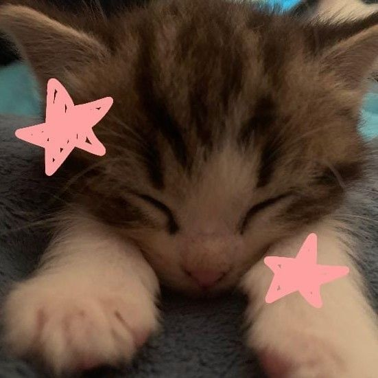

# Gato-Olly | Desafio Estudonauta

Estou estudando no Estudonauta, um curso do Gustavo Guanabara. Lembro que no curso em vídeo (que também é dele) tínhamos que criar esse site. Então, aqui estou eu de novo, não só refazendo o site, mas também dando uma nova cara ao que fiz há um ano atrás. 

O Guanabara sempre nos encoraja a experimentar, a tentar coisas novas para ver no que dá. Inspirado por isso, decidi reformular completamente o site. Adicionei vários links no menu de navegação, pois ele só ensina a página inicial, que neste projeto seria a parte de "Cuidados Essenciais".

### Mostrando os dois sites feitos

## Gato Mania:
 Imagine um site sobre gatos, mas com cores e fontes que fazem até o mais despreocupado dos gatos soltar um miau de desaprovação. É, preciso urgente de um curso UI/UX design antes que eu seja banida da comunidade dev! KKKKKK [clique aqui pra ver o site gato mania](https://gatomania.netlify.app/) 

 * repositorio do [Gato Mania](https://github.com/Glssv/Site-GatoMania)

---

## Gato Olly:
Aqui está a versão mais recente do site! Com novas paletas de cores, fontes e conteúdo novo. Para descobrir mais sobre este projeto e o projeto 'Gato Mania', basta conferir os READMEs dos dois repositórios, onde tudo está explicadinho. [clique aqui para ver o site gato olly](https://gato-olly.netlify.app/)

* repositorio do [Gato Olly](https://github.com/Glssv/Gato-Olly)

---
### Estou muito orgulhosa do que fiz, e a maior parte foi feita completamente por mim. Claro, em alguns momentos pedi ajuda, mas ainda assim estou orgulhosa do meu progresso e evolução.

## E qual a proposta do desafio? 

### A proposta do desafio é criar uma página com as seguintes características:

* Um cabeçalho com tons degradê.
* Um menu simples.
* Um artigo com títulos, imagens, vídeos e conteúdo relacionado.
* Uma lista com marcadores personalizados.
* Links externos identificados com emojis.
* Um rodapé com links.

## Nesta nova versão, optei por:
* Paleta de cores diferentes.  
* Conteúdo diferente.
* Fontes novas.
* Além de incluir novas fotos e vídeos.

## Como eu comecei o MEU projeto baseado nesse do guanabara?

### Paleta de cores

Comecei escolhendo uma paleta de cores. Após ver algumas opções no Pinterest e me interessar por algumas, fui para o [paletton](https://paletton.com/#uid=1000u0kllllaFw0g0qFqFg0w0aF) e comecei a explorar as variáveis. Procurei por cores que se complementassem e então criei minha própria paleta. A cor inicial que selecionei foi a número 1, mas ao explorar as cores análogas e complementares, cheguei à paleta final, que foi a número 4.

<h2 align="center">
  
</h2>

### Conteúdo diferente 
bem, eu resolvi fazer esse site com uma coisa que eu amo: GATOS  
Então, pensei: "Por que não fazer um site como se fosse o diário de um gato?" E assim fiz a primeira página, onde Olly (meu gato) se apresenta e fala um pouco sobre ele, e ele fala que vai compartilhar seu diário conosco, dando dicas e compartilhando vídeos engraçados de gatinhos para mamães e papais de pets de primeira viagem.

## Fontes usadas
 - fonte-padrao:'Nunito', sans-serif;
 - fonte-destaque: 'candara';

Mais uma vez venho aqui dizer que estou extremamente orgulhosa de mim! obrigada guanabara por me ensinar tanto 🧡

---

<h2 align="center">
  
</h2>

Desenvolvido com 🧡

